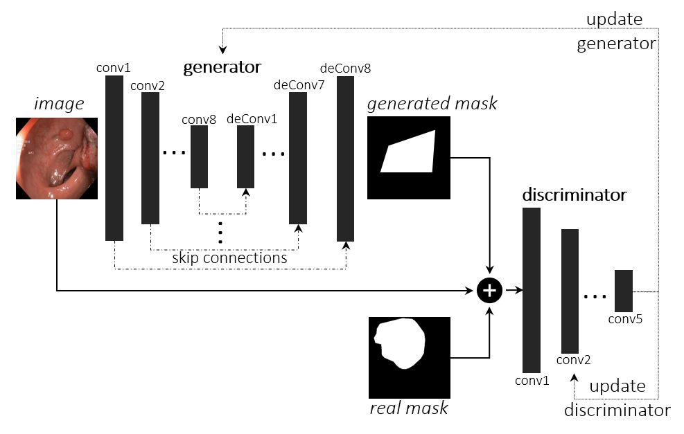
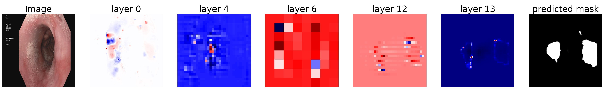
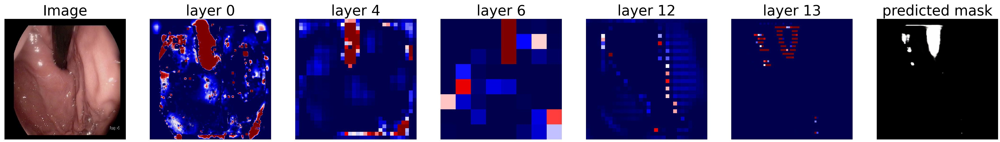
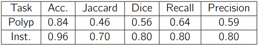

# MedAI: Transparency in Medical Image Segmentation

## What is this repo
This repo contains the code and experiments that are implemented to contribute in [MedAI Cahllenge: Transparency in Medical Image Segmentation]( https://www.nora.ai/Competition/image-segmentation.html) to automate medical image segmentation while preserve transparency. In the paper below we proposed generative adversarial network-based models to segment both polyps and instruments in endoscopy images. We also provide explanations for the predictions using a layer-wise relevance propagation approach.  

## Reference papers
#### Working paper:
Explainable Medical Image Segmentation via Generative Adversarial Networks and Layer-wise Relevance Propagation, Awadelrahman Ahmed, Leen Ali, Nordic Machine Intelligence.
https://journals.uio.no/NMI/article/view/9126

#### Challenge details paper:
  
BibTeX:  
@article{MediAI2021,
    title = {{MedAI: Transparency in Medical Image Segmentation}},
    author = {
        Hicks, Steven and
        Jha, Debesh and
        Thambawita, Vajira and
        Riegler, Michael and
        Halvorsen, P{\aa}l and
        Singstad, Bj{\o}rn-Jostein and
        Gaur, Sachin and
        Pettersen, Klas and
        Goodwin, Morten and
        Parasa, Sravanthi and
        de Lange, Thomas
    },
    journal = {Nordic Machine Intelligence},   
    year = {2021},
    doi = {10.5617/nmi.9140}
    
## Model

 

## Sample Results

### Polyp secmentation task sample

### Instrument secmentation task sample

## Evaluation

